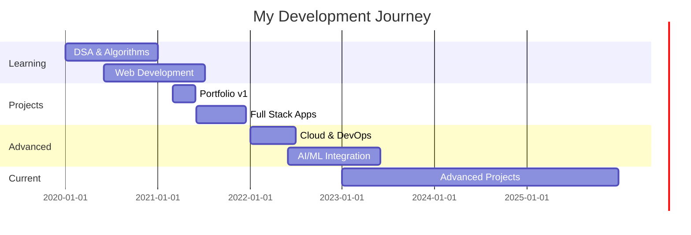

<div align="center">
  
</div>

<div align="center">
  
</div>

<div align="center">
  
  [](https://piyush07-pi.vercel.app/)
  [](https://www.linkedin.com/in/piyush070/)
  [](https://github.com/PIYUSH0-7)
  [](https://dev-path-tracker.vercel.app/)
  
  
  
  
  
</div>


<div align="center">
  
## 🎯 About Me

```typescript
const piyush = {
    pronouns: "He" | "Him",
    location: "India 🇮🇳",
    role: "Full Stack Developer & AI Enthusiast",
    code: ["JavaScript", "TypeScript", "Python", "C++", "Java"],
    askMeAbout: ["Web Dev", "AI/ML", "Cloud Architecture", "System Design"],
    technologies: {
        frontEnd: {
            js: ["React", "Next.js", "Redux", "Vue"],
            css: ["Tailwind", "Bootstrap", "Material-UI", "Styled-Components"]
        },
        backEnd: {
            js: ["Node.js", "Express", "Nest.js"],
            python: ["Django", "Flask", "FastAPI"]
        },
        databases: ["MongoDB", "PostgreSQL", "MySQL", "Redis", "Firebase"],
        cloud: ["AWS", "Google Cloud", "Azure", "Vercel", "Netlify"],
        devOps: ["Docker", "Kubernetes", "GitHub Actions", "Jenkins"],
        ai: ["TensorFlow", "PyTorch", "OpenAI", "LangChain"]
    },
    currentFocus: "Building AI-powered full-stack applications",
    funFact: "I debug with console.log() and I'm not ashamed! 😄"
};
```

</div>


## 🛠️ Tech Arsenal

<div align="center">

### 💻 Languages


### 🎨 Frontend Development


### ⚙️ Backend Development


### 🗄️ Databases & Cloud


### ☁️ Cloud & DevOps


### 🤖 AI & Machine Learning


### 🔧 Tools & Others


</div>


## 📊 GitHub Analytics

<div align="center">
  
  
</div>

<div align="center">
  
</div>

<div align="center">
  
</div>

<div align="center">
  
</div>


## 🐍 Contribution Graph

<div align="center">
  <picture>
    <source media="(prefers-color-scheme: dark)" srcset="https://raw.githubusercontent.com/PIYUSH0-7/PIYUSH0-7/output/github-contribution-grid-snake-dark.svg">
    <source media="(prefers-color-scheme: light)" srcset="https://raw.githubusercontent.com/PIYUSH0-7/PIYUSH0-7/output/github-contribution-grid-snake.svg">
    
  </picture>
</div>


## 🏆 LeetCode Stats

<div align="center">
  
</div>


## 🚀 Featured Projects

<div align="center">

<a href="https://github.com/PIYUSH0-7/project-alpha">
  
</a>

<a href="https://github.com/PIYUSH0-7/LeetCode-Proofs-DSA-Practice-">
  
</a>

</div>

<div align="center">
  
### 💡 Project Highlights

| Project | Description | Tech Stack | Status |
|---------|-------------|-----------|--------|
| 🌟 **Project Alpha** | Next-gen full-stack application | MERN, Next.js, TypeScript | 🚧 In Progress |
| 🤖 **VisionAI** | AI-powered automation suite | Python, TensorFlow, OpenAI | 🚧 In Progress |
| 📊 **Dev Path Tracker** | Developer journey tracker | React, Firebase, Chart.js | ✅ Live |
| 💼 **Portfolio V2** | Personal portfolio website | Next.js, Tailwind, Framer | ✅ Live |

</div>


## 📝 Latest Blog Posts

<!-- BLOG-POST-LIST:START -->
- 🚀 Building Scalable Microservices with Node.js
- 🤖 Getting Started with AI Integration in Web Apps
- 💡 Advanced React Patterns for Production Apps
- ☁️ Deploying Full Stack Apps on AWS
<!-- BLOG-POST-LIST:END -->


## 💼 Work Experience Timeline




## 🎯 2024 Goals

- [x] Master TypeScript & Advanced React Patterns
- [x] Build 5+ Full Stack Production Apps
- [ ] Contribute to 10+ Open Source Projects
- [ ] Launch Personal SaaS Product
- [ ] Write 20+ Technical Blog Posts
- [ ] Reach 1000+ GitHub Followers
- [ ] Master System Design & Architecture
- [ ] Deep Dive into AI/ML Engineering


## 💻 Coding Activity

<div align="center">
  
<!--START_SECTION:waka-->
```text
TypeScript   12 hrs 30 mins  ███████████░░░░  45.2%
JavaScript   8 hrs 15 mins   ███████▒░░░░░░░  29.8%
Python       4 hrs 20 mins   ████░░░░░░░░░░░  15.7%
CSS          1 hr 45 mins    █▒░░░░░░░░░░░░░   6.3%
JSON         50 mins         ▒░░░░░░░░░░░░░░   3.0%
```
<!--END_SECTION:waka-->

</div>


## 🌟 Support My Work

<div align="center">

If you like my work, consider:

[](https://buymeacoffee.com/piyush07)
[](https://github.com/sponsors/PIYUSH0-7)

</div>


## 📫 Let's Connect

<div align="center">

### 💬 I'm always open to interesting conversations and collaboration!

[](mailto:piyush.gangwar@example.com)
[](https://www.linkedin.com/in/piyush070/)
[](https://twitter.com/piyush07)
[](https://piyush07-pi.vercel.app/)
[](https://dev.to/piyush07)

</div>


<div align="center">
  
### 💭 Random Dev Quote


### 😄 Here's a Joke to Brighten Your Day


</div>


<div align="center">
  
## 🎵 Spotify Playing

[](https://open.spotify.com/user/YOUR_SPOTIFY_ID)

</div>


<div align="center">

### ⚡ "Code is like humor. When you have to explain it, it's bad." - Cory House

<br>

### 🌟 If this profile inspires you, give it a star! ⭐

<br>


### 💫 Thank you for visiting! Let's build something amazing together! 💫

<br>


</div>
