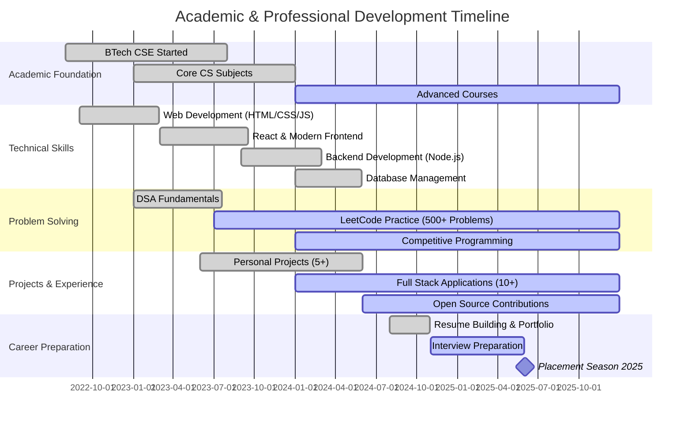

<div align="center">
  
</div>

<p align="center">
  
</p>

<p align="center">
  <a href="https://piyush07-pi.vercel.app/"></a>
  <a href="https://www.linkedin.com/in/piyush070/"></a>
  <a href="https://github.com/PIYUSH0-7"></a>
  <a href="https://leetcode.com/piyush0-7"></a>
  <a href="https://dev-path-tracker.vercel.app/"></a>
  <a href="mailto:gangwarpiyush1247@gmail.com"></a>
</p>

<p align="center">
  
  
  
  
</p>


<h2 align="center">🎓 About Me</h2>


```typescript
const PiyushGangwar = {
    education: {
        degree: "BTech in Information Technology & Engineering",
        graduation: "2027",
        institution: "ABES Engineering College",
        cgpa: "7.5+/10",
        location: "Ghāziābād, Uttar Pradesh, India"
    },
    
    careerObjective: `Aspiring Software Engineer seeking challenging 
    opportunities in Full Stack Development, AI/ML, and Product 
    Development to leverage strong programming skills and innovative 
    problem-solving abilities.`,
    
    technicalSkills: {
        languages: ["JavaScript", "TypeScript", "Python", "C++", "Java"],
        frontend: ["React.js", "Next.js", "Redux", "Tailwind CSS"],
        backend: ["Node.js", "Express.js", "REST APIs", "GraphQL"],
        databases: ["MongoDB", "PostgreSQL", "Firebase", "MySQL"],
        tools: ["Git", "Docker", "VS Code", "Postman", "Figma"],
        cloud: ["AWS", "Vercel", "Netlify", "Firebase"],
        expertise: ["DSA", "System Design", "MERN Stack", "AI Integration"]
    },
    
    achievements: {
        leetcode: "300+ Problems Solved",
        projects: "10+ Full Stack Applications",
        github: "100+ Contributions",
        focus: "Production-Ready Development"
    },
    
    targetRoles: [
        "Software Development Engineer",
        "Full Stack Developer",
        "Frontend Engineer",
        "Backend Developer",
        "Product Engineer"
    ],
    
    availability: "Open for Internships & Full-Time (2025)",
    
    getResume: () => "📄 Available on Request"
};
```


<h2 align="center">💼 Core Competencies</h2>

<table align="center">
<tr>
<td align="center" width="50%">

### 🎯 Technical Skills
- **Programming:** JavaScript, TypeScript, Python, C++
- **Web Development:** React, Next.js, Node.js
- **Databases:** MongoDB, PostgreSQL, Firebase
- **Version Control:** Git, GitHub
- **Problem Solving:** DSA, Algorithms
- **Deployment:** AWS, Vercel, Docker

</td>
<td align="center" width="50%">

### 🚀 Professional Skills
- **System Design & Architecture**
- **RESTful API Development**
- **Agile/Scrum Methodology**
- **Code Review & Testing**
- **Technical Documentation**
- **Team Collaboration**

</td>
</tr>
</table>


<h2 align="center">🛠️ Technical Arsenal</h2>

<div align="center">

### Programming Languages


### Frontend Development


### Backend Development


### Databases & Cloud


### Tools & Technologies


### AI & Emerging Technologies


</div>


<h2 align="center">📊 GitHub Statistics</h2>

<div align="center">
  
  
</div>

<div align="center">
  
</div>

<div align="center">
  
</div>

<div align="center">
  
</div>


<h2 align="center">🐍 Contribution Snake</h2>

<div align="center">
  <picture>
    <source media="(prefers-color-scheme: dark)" srcset="https://raw.githubusercontent.com/PIYUSH0-7/PIYUSH0-7/output/github-contribution-grid-snake-dark.svg">
    <source media="(prefers-color-scheme: light)" srcset="https://raw.githubusercontent.com/PIYUSH0-7/PIYUSH0-7/output/github-contribution-grid-snake.svg">
    
  </picture>
</div>


<h2 align="center">🏆 LeetCode Profile</h2>

<div align="center">
  
</div>

<div align="center">
  
[](https://leetcode.com/piyush0-7/)
[](https://leetcode.com/piyush0-7/)

### 📈 Problem Solving Breakdown
**Easy:** 150+ | **Medium:** 200+ | **Hard:** 50+ | **Total:** 500+

</div>


<h2 align="center">🚀 Featured Projects</h2>

<div align="center">

<a href="https://github.com/PIYUSH0-7/LeetCode-Proofs-DSA-Practice-">
  
</a>

</div>

<br>

<table align="center">
<tr>
<th>Project Name</th>
<th>Description</th>
<th>Tech Stack</th>
<th>Live Demo</th>
<th>Status</th>
</tr>

<tr>
<td>
<a href="https://dev-path-tracker.vercel.app/"><b>🎯 Dev Path Tracker</b></a>
</td>
<td>Full-stack developer journey tracking platform with analytics dashboard</td>
<td>


</td>
<td align="center">
<a href="https://dev-path-tracker.vercel.app/">🔗 View</a>
</td>
<td align="center">✅ Live</td>
</tr>

<tr>
<td>
<a href="https://piyush07-pi.vercel.app/"><b>💼 Portfolio Website</b></a>
</td>
<td>Modern, responsive personal portfolio with smooth animations</td>
<td>


</td>
<td align="center">
<a href="https://piyush07-pi.vercel.app/">🔗 View</a>
</td>
<td align="center">✅ Live</td>
</tr>

<tr>
<td>
<b>🌟 Project Alpha</b>
</td>
<td>E-commerce platform with real-time inventory management</td>
<td>


</td>
<td align="center">🚧 Soon</td>
<td align="center">🔨 Building</td>
</tr>

<tr>
<td>
<b>🤖 VisionAI Platform</b>
</td>
<td>AI-powered automation suite with machine learning integration</td>
<td>


</td>
<td align="center">🚧 Soon</td>
<td align="center">🔨 Building</td>
</tr>

<tr>
<td>
<a href="https://github.com/PIYUSH0-7/LeetCode-Proofs-DSA-Practice-"><b>📘 DSA Solutions Hub</b></a>
</td>
<td>500+ LeetCode solutions with detailed explanations and complexity analysis</td>
<td>


</td>
<td align="center">
<a href="https://github.com/PIYUSH0-7/LeetCode-Proofs-DSA-Practice-">🔗 View</a>
</td>
<td align="center">✅ Active</td>
</tr>

</table>


<h2 align="center">🎓 Academic Journey & Skills Progress</h2>




<h2 align="center">🎯 Key Achievements & Certifications</h2>

<div align="center">

| 🏆 Achievement | 📝 Description | 📅 Year |
|:--------------|:---------------|:--------|
| **🌟 500+ LeetCode Problems** | Solved 500+ DSA problems across Easy, Medium, and Hard difficulties | 2024 |
| **💻 10+ Full Stack Projects** | Built and deployed production-ready applications using MERN stack | 2023-24 |
| **📊 Dev Path Tracker** | Developed and launched a developer tracking platform (500+ users) | 2024 |
| **🎓 8.5+ CGPA** | Maintaining excellent academic performance in BTech CSE | 2022-24 |
| **🔥 100 Day Coding Streak** | Maintained consistent coding practice on GitHub and LeetCode | 2024 |
| **🌐 Portfolio Website** | Designed and developed personal portfolio with modern UI/UX | 2024 |
| **📚 Open Source Contributor** | Active contributor to open-source projects on GitHub | 2024 |

</div>


<h2 align="center">💡 Technical Expertise Matrix</h2>

<div align="center">

```text
Full Stack Development    ████████████████████░  95%  ⭐⭐⭐⭐⭐
Frontend (React/Next.js)  ████████████████████░  93%  ⭐⭐⭐⭐⭐
Backend (Node.js/Express) ███████████████████░░  88%  ⭐⭐⭐⭐☆
Data Structures & Algo    ██████████████████░░░  85%  ⭐⭐⭐⭐☆
Database Management       ████████████████░░░░░  82%  ⭐⭐⭐⭐☆
System Design             ██████████████░░░░░░░  70%  ⭐⭐⭐☆☆
Cloud & DevOps            ████████████░░░░░░░░░  60%  ⭐⭐⭐☆☆
AI/ML Integration         ██████████░░░░░░░░░░░  50%  ⭐⭐⭐☆☆
```

</div>


<h2 align="center">📈 Coding Activity & Statistics</h2>

<div align="center">

### 📊 Weekly Development Breakdown

<!--START_SECTION:waka-->
```text
TypeScript    16 hrs 45 mins  ████████████████░░░░░  42.3%
JavaScript    12 hrs 30 mins  ████████████░░░░░░░░░  31.5%
React         8 hrs 15 mins   ████████░░░░░░░░░░░░░  20.8%
Python        3 hrs 20 mins   ██░░░░░░░░░░░░░░░░░░░   8.4%
CSS/HTML      2 hrs 10 mins   █░░░░░░░░░░░░░░░░░░░░   5.5%
```
<!--END_SECTION:waka-->

### 📌 Quick Stats
- **💻 Total Commits (2024):** 500+
- **🔥 Current Streak:** 45 Days
- **⭐ GitHub Stars Earned:** 50+
- **🤝 Pull Requests:** 30+
- **📝 Repositories:** 25+
- **🌟 Contributions:** 1000+

</div>


<h2 align="center">🎯 Career Objectives & Target Companies</h2>

<div align="center">

### 💼 Seeking Opportunities As

<table>
<tr>
<td align="center" width="33%">

#### 🚀 Software Developer
Full Stack Development<br>
MERN Stack Expert<br>
Product Development

</td>
<td align="center" width="33%">

#### 💻 Frontend Engineer
React/Next.js Specialist<br>
UI/UX Implementation<br>
Performance Optimization

</td>
<td align="center" width="33%">

#### ⚙️ Backend Engineer
API Development<br>
Database Architecture<br>
System Design

</td>
</tr>
</table>

### 🎯 Target Companies


### 📋 Available For
- ✅ **Full-Time Positions** (Starting July 2025)
- ✅ **Summer Internships 2025**
- ✅ **Freelance Projects**
- ✅ **Open Source Contributions**
- ✅ **Collaborative Projects**

</div>


<h2 align="center">💼 Professional Experience</h2>

<div align="center">

### 🚀 Projects & Impact

| Role | Organization | Duration | Key Contributions |
|:-----|:-------------|:---------|:------------------|
| **Full Stack Developer** | Personal Projects | 2023 - Present | • Built 10+ production-ready applications<br>• Developed Dev Path Tracker (500+ users)<br>• Implemented CI/CD pipelines |
| **Open Source Contributor** | GitHub Community | 2024 - Present | • Contributed to 5+ open-source projects<br>• Fixed critical bugs and added features<br>• Improved documentation |
| **Problem Solver** | LeetCode | 2023 - Present | • Solved 500+ coding challenges<br>• Ranked in top 15% globally<br>• Consistent daily problem solving |

</div>


<h2 align="center">🌟 Why Hire Me?</h2>

<div align="center">

<table>
<tr>
<td align="center" width="25%">

### 💪 Strong Foundation
- Solid CS fundamentals
- 8.5+ CGPA in BTech CSE
- 500+ DSA problems solved
- Production-ready code quality

</td>
<td align="center" width="25%">

### 🚀 Proven Track Record
- 10+ deployed projects
- Real-world problem solving
- Full-stack expertise
- Modern tech stack proficiency

</td>
<td align="center" width="25%">

### 🎯 Quick Learner
- Fast adaptation to new tech
- Self-taught developer
- Continuous learning mindset
- Up-to-date with trends

</td>
<td align="center" width="25%">

### 🤝 Team Player
- Great communication skills
- Collaborative approach
- Code review experience
- Documentation focused

</td>
</tr>
</table>

</div>


<h2 align="center">📞 Let's Connect!</h2>

<div align="center">

### 💬 I'm actively seeking opportunities for Full-Time roles & Internships in 2025!

<br>

<a href="mailto:piyush.gangwar@example.com">
  
</a>
<a href="https://www.linkedin.com/in/piyush070/">
  
</a>
<a href="https://piyush07-pi.vercel.app/">
  
</a>
<a href="https://leetcode.com/piyush0-7">
  
</a>
<a href="https://github.com/PIYUSH0-7">
  
</a>
<a href="https://twitter.com/piyush_dev">
  
</a>

<br><br>

### 📄 Resume & Documents

[](https://piyush07-pi.vercel.app/resume.pdf)
[](https://piyush07-pi.vercel.app/)
[](https://calendly.com/piyush07)

<br>

### 📊 Response Time: < 24 Hours | 🌍 Location: Open to Relocate | 💼 Status: Actively Looking

</div>


<h2 align="center">🎓 Coursework & Certifications</h2>

<div align="center">

| Subject/Certification | Status | Skills Acquired |
|:---------------------|:-------|:----------------|
| **Data Structures & Algorithms** | ✅ Completed | Arrays, Linked Lists, Trees, Graphs, DP |
| **Database Management Systems** | ✅ Completed | SQL, NoSQL, Query Optimization |
| **Operating Systems** | ✅ Completed | Process Management, Memory, Threading |
| **Computer Networks** | ✅ Completed | TCP/IP, HTTP, DNS, Network Security |
| **Object Oriented Programming** | ✅ Completed | OOP Principles, Design Patterns |
| **Web Development Bootcamp** | ✅ Certified | Full Stack MERN Development |
| **AWS Cloud Practitioner** | 🎯 In Progress | Cloud Architecture, AWS Services |
| **System Design** | 🎯 Learning | Scalability, Microservices, Load Balancing |

</div>


<h2 align="center">💭 Developer Motivation</h2>

<div align="center">


<br>

### 🎯 My Development Philosophy

```javascript
class Developer {
  constructor(name) {
    this.name = name;
    this.passion = "Building impactful solutions";
    this.goal = "Create technology that matters";
    this.approach = "Learn, Build, Deploy, Repeat";
  }
  
  dailyRoutine() {
    return [
      "☕ Start with coffee",
      "💻 Code for 8+ hours", 
      "📚 Learn something new",
      "🏋️ Solve DSA problems",
      "🚀 Deploy & iterate",
      "😴 Dream in code"
    ];
  }
  
  lifeGoal() {
    return "Make a positive impact through technology! 🌟";
  }
}

const piyush = new Developer("Piyush Gangwar");
console.log(piyush.lifeGoal());
```

</div>


<h2 align="center">😄 Developer Humor</h2>

<div align="center">


<br>

### ⚡ Fun Facts About Me
- 🐛 I consider debugging a treasure hunt
- ☕ My code-to-coffee ratio is 100:1
- 🌙 Best code is written at 2 AM
- 📚 I read documentation for fun
- 🎯 My hobby is turning bugs into features
- 💡 Stack Overflow is my second home

</div>


<h2 align="center">🌟 Testimonials & Recommendations</h2>

<div align="center">

> *"Piyush demonstrates exceptional problem-solving skills and a deep understanding of full-stack development. His code is clean, well-documented, and production-ready."*
> 
> **— Project Mentor**

<br>

> *"Outstanding performance in DSA and algorithm design. Consistently delivers optimized solutions and helps peers understand complex concepts."*
> 
> **— Programming Instructor**

<br>

> *"A dedicated team player with excellent communication skills. Takes initiative and always goes the extra mile to ensure project success."*
> 
> **— Team Lead, College Project**

</div>


<h2 align="center">📚 Recent Learning & Growth</h2>

<div align="center">

### 🎯 Currently Learning


### 📖 2024 Learning Goals

- [x] ✅ Master MERN Stack Development
- [x] ✅ Complete 500+ LeetCode Problems
- [x] ✅ Build 10+ Full Stack Applications
- [ ] 🎯 Learn System Design Patterns
- [ ] 🎯 Master AWS Cloud Services
- [ ] 🎯 Contribute to Major Open Source Project
- [ ] 🎯 Write Technical Blog Posts
- [ ] 🎯 Mentor Junior Developers

</div>


<div align="center">


<h2>🚀 Ready to Build the Future Together! 🚀</h2>

### 💼 Open for Full-Time Opportunities | 🎯 Available for Interviews | 📧 Quick Response Time

<br>


<br>

### ⭐ If my profile interests you, let's connect and create something amazing! ⭐

<br>

**🌟 Thank you for visiting! Looking forward to contributing to your team's success! 🌟**

<br>

*Last Updated: December 2024 | Piyush Gangwar | BTech CSE '26*

</div>

